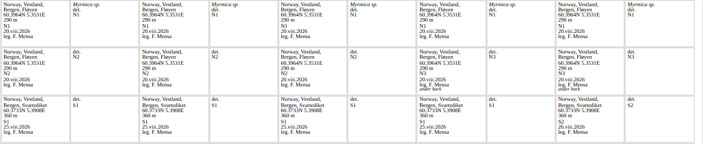
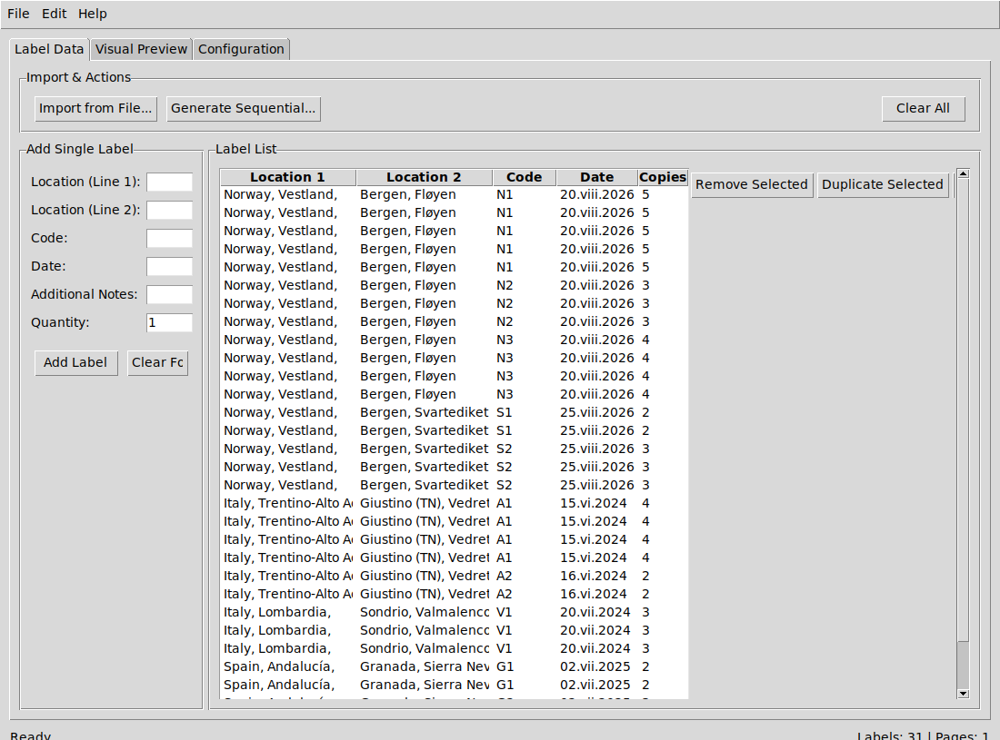
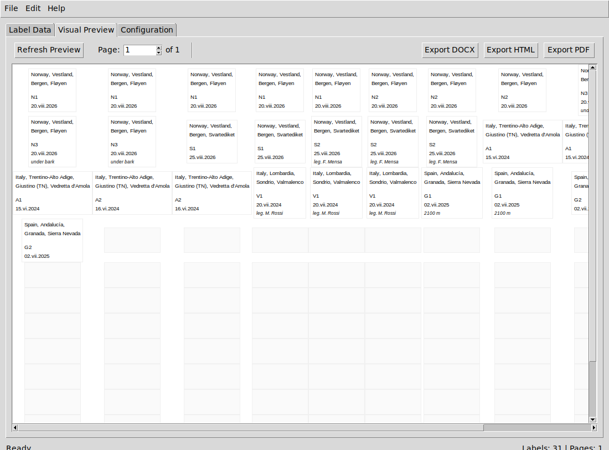

# Entomology Labels

Printable specimen labels for insect collections. Reads your collection data
from a spreadsheet or a text file, lays it out many-to-a-sheet, and writes HTML,
PDF or Word.



Labels are paired: a locality label, and a determination label to pin below it.

## Install

```bash
pip install 'entomology-labels[all]'
```

The `[all]` extra pulls in Excel, Word, PDF and photo-metadata support. Install
the bare package if you only need HTML and CSV. PDF output needs system
libraries for weasyprint; if that is awkward, generate HTML and print it from a
browser instead.

## Print some labels

```bash
entomology-labels template my_labels.csv --format csv   # a file to fill in
entomology-labels generate my_labels.csv -o labels.html --preset museum
```

Open the HTML and print it, with margins set to none.

A row looks like this:

```csv
location_line1,location_line2,code,date,count
"Norway, Vestland,","Bergen, Fløyen",N1,20.viii.2026,5
```

`count` prints that many copies. Dates use the entomological convention of a
Roman-numeral month — `20.viii.2026` — which avoids the day/month ambiguity of
all-numeric dates. Excel, JSON, YAML, tab-separated text and Word tables all
work as input; column headings are matched loosely, and the Italian headings
older files use are still accepted.

## From field photographs

If your camera geotags, it already recorded when and where you collected.

```bash
entomology-labels photos probe ~/Pictures/2026-08-20      # check what it reads
entomology-labels photos scan ~/Pictures/2026-08-20 -o sites.yaml
```

`scan` groups photographs into collection sites by time and distance — forty
frames from one morning become one site — and writes a draft with the dates and
coordinates filled in. Fill in the place names, add your specimen codes, then
generate from it. Raw formats work; ORF, NEF, CR2 and DNG are read directly.

Add `--geocode` and it will suggest place names from OpenStreetMap. Suggestions
are written as comments for you to confirm, never filled in automatically. It is
off by default because it sends your coordinates to a third party, which is your
call to make each time.

## Declare a site once

Repeating a locality on every row is tedious and hard to correct. Declare it
once instead:

```yaml
defaults:
  collector: "F. Mensa"

sites:
  FLOYEN:
    location_line1: "Norway, Vestland,"
    location_line2: "Bergen, Fløyen"
    coordinates: {lat: 60.3964, lon: 5.3531}
    elevation_m: 293
    date: 2026-08-20        # ISO in, 20.viii.2026 on the label

labels:
  - {site: FLOYEN, code: N1, species: "Myrmica sp.", count: 5}
  - {site: FLOYEN, code: N2, count: 3}
  - {site: FLOYEN, code: N3, date: 21.viii.2026}   # same site, next day
```

Values resolve row first, then site, then defaults. A row with no `site:` still
works, so existing flat files need no changes. For CSV, keep the sites in their
own file and pass `--sites sites.yaml`.

See `examples/example_sites.yaml` for a complete one.

## Label size

```bash
entomology-labels presets
```

| Preset | Size | Per A4 sheet |
|---|---|---|
| `museum` | 15.2 × 8.1 mm, 4 pt | 475 |
| `museum-wide` | 17.8 × 12.3 mm, 4 pt | 272 |
| `readable` | 24 × 15.5 mm, 5 pt | 156 |
| `legacy` | 29 × 13 mm, 6 pt | 160 |

The smaller sizes follow published guidance from entomological collections,
which recommends labels around 15–18 mm wide in 4 pt type. `museum-wide` leaves
room for coordinates and elevation; `museum` fits the classic five-line locality
label. `legacy` reproduces this tool's original geometry, for reprinting old
sheets.

Individual settings override a preset:

```bash
entomology-labels generate data.csv -o labels.html --preset museum --font-size 5
```

Save a layout you like and reuse it:

```bash
entomology-labels generate data.csv -o labels.html --preset museum --save-config sheet.json
entomology-labels generate more.csv -o more.html --config sheet.json
```

A `label_config.json` in the working directory is picked up automatically.

## Warnings

Before writing output, the tool checks that the labels fit and says so if they
do not:

```
warning: label 1: 9 lines at 6.0pt need about 21.0mm, but the label is only
         13.0mm tall; lower lines will be cut off
warning: label 16: "Italy, Trentino-Alto Adige," is about 31.4mm wide and will
         wrap onto another line at 27.0mm
```

Overlong text wraps by default rather than being trimmed, so nothing is lost
silently. `--text-overflow clip` restores the old behaviour. `--strict-fit`
turns these warnings into a non-zero exit.

## Graphical interface

```bash
entomology-labels-gui
```



Import a file or type labels in, then check the preview before printing.



## Fields

| Field | Prints as | Notes |
|---|---|---|
| `location_line1` | first line | country, region |
| `location_line2` | second line | municipality, locality |
| `coordinates` | `60.3964N 5.3531E` | from a site, or written out |
| `elevation` | `290 m` | |
| `code` | `N1` | your specimen number |
| `date` | `20.viii.2026` | |
| `collector` | `leg. F. Mensa` | |
| `species` | italic | goes on the determination label |
| `determiner` | `det. F. Mensa` | goes on the determination label |
| `additional_info` | italic, smaller | habitat, method, anything else |

`--label-kind` chooses which labels to print: `locality` (default),
`determination`, or `both`.

## Python

```python
from entomology_labels import Label, LabelConfig, LabelGenerator, load_data, generate_html
from entomology_labels.presets import get_preset

generator = LabelGenerator(LabelConfig(**get_preset("museum")))
generator.add_labels(load_data("specimens.csv"))
generate_html(generator, "labels.html")
```

`entomology-labels info` lists the accepted input formats and column names.

## Contributing

See [CONTRIBUTING.md](CONTRIBUTING.md). Bug reports are welcome, especially
labels that print wrong — include the input file and the command you ran.

## Licence

MIT. See [LICENSE](LICENSE).

Inspired by [insect-labels](https://github.com/tracyyao27/insect-labels) by
Tracy Yao.
